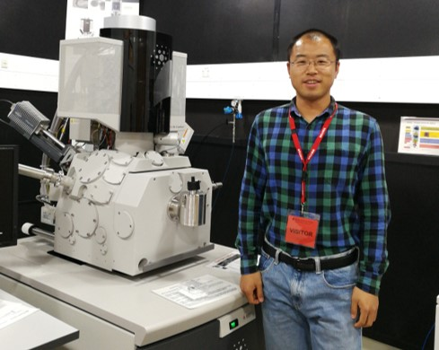

<table border="0">
  <tr>
    <td width="55%">
      <h1>宋利伟</h1>
      
<b>副教授</b>

      
<b>东北石油大学物理与电子工程学院</b>

      
<b>邮箱:zhidao90@163.com</b>

      
<b>地址:黑龙江省大庆市高新技术产业开发区学府街99号</b>

      
<b>邮编:163318</b>

    </td>
    <td width="45%">
      
    </td>
  </tr>
</table>

## 个人简介

宋利伟，男，汉族，1986年12月生，黑龙江省齐齐哈尔市人，中共党员，博士（后）/副教授，黑龙江省优青，黑龙江省高校青年创新人才，澳大利亚莫纳什大学访问学者，国际SCI期刊审稿人，勘探地球物理学家协会会员。

主持国家自然科学基金面上项目1项、黑龙江省自然科学基金优秀青年项目1项、黑龙江省高校青年创新人才项目1项、东北石油大学青年科学基金项目1项、东北石油大学引导性创新基金项目1项、大庆市创新性指导项目1项。作为重要骨干参加国家自然科学基金重点项目项、黑龙江省自然科学基金项目3项、企业攻关课题10余项。发表学术论文20余篇，其中SCI期刊论文7篇、EI期刊论文3篇。授权发明专利3项、软件著作权3项。获黑龙江省科学技术三等奖1项。

### 主要研究方向
人工智能应用技术、复杂介质构造成像、波动理论及波场模拟、CPU/GPU协同并行加速计算等方面的研究.

### 教育及工作背景
1. 教育经历：  
(1) 2014-09 至 2018-12, 东北石油大学, 博士.  
(2) 2009-09 至 2012-07, 黑龙江大学, 硕士.  
(3) 2005-09 至 2009-07, 黑龙江大学, 学士.  
2. 博士后工作经历：   
(1) 2020-07 至 今, 在站, 大庆油田勘探开发研究院博士后工作站.
3. 科研与学术工作经历：  
(1)2022-09 至 今, 东北石油大学, 副教授.  
(2)2018-12 至 2019-12, 澳大利亚莫纳什大学, 访问学者.  
(4)2014-09 至 2022-08, 东北石油大学, 讲师.

### 科研项目情况
1. 物理和数据混合驱动的黏弹性介质纯P波最小二乘逆时偏移方法，**国家自然基金（面上项目）**，2023.01-2026.12,主持.
2. 多方位多时刻三维最小二乘逆时偏移方法研究，**国家自然基金（青年基金）**，2019.01-2021.12,参加.
3. VSP全波场反演偏移成像，**国家自然基金（面上项目）**，2016.01-2019.12,参加.
4. 声波模拟软件师资培训，**教育部产学合作协同育人项目**，2022.11-2023.12,主持.
5. 基于深度学习的黏声介质深层构造逆时偏移研究，**黑龙江省青年创新人才项目**，2020.10-2023.10,主持.
6. VSP最小二乘逆时偏移研究，**黑龙江省自然科学基金（杰出青年项目）**，2016.07-2019.07,参加.
7. 页岩油储层地震波场模拟及逆时成像方法研究,**黑龙江省自然科学基金（优秀青年项目）**,2021.07-2024.07,参加.
8. 基于深度学习的黏滞性介质最小二乘逆时偏移研究，**大庆市创新性指导项目**，2022.01-2024.06,主持.
9. 黏性介质地震波数值模拟及逆时偏移，**东北石油大学青年科学基金**，2019.10-2022.10,主持.
10. 各向异性介质逆时偏移成像方法研究，**东北石油大学引导性创新基金**，2017.03-2018.12,主持.

### 代表性论文
1. **Liwei Song**, Ying Shi, Wei Liu, Qiang Zhao. Elastic Reverse Time Migration for Weakly Illuminated Structure. Applied Sciences. 2022, 12(10):5264.
2. **Liwei Song**, Ying Shi, Shumin Chen, et al. Target-oriented reverse time migration in transverse isotropy media. Acta Geophysica, 2021, 69(1)：125-134.
3. **宋利伟**,石颖,陈树民等.地下黏弹性介质波动方程及波场数值模拟.物理学报,2021,70(14):409-415.
4. **Liwei Song**, Ying Shi, Xuan Ke. Reverse time migration of TTI media using the decomposed wavefiled. Journal of Seismic Exploration, 2019, 28(3):245-256.
5. **宋利伟**,石颖,柯璇.基于解析法波场分离的逆时偏移成像.地球物理学进展,2018, 33(04):1573-1578.
6. **宋利伟**,石颖,柯璇等.基于检查点方法的各向异性介质逆时偏移.石油物探,2018,57(02):274-282.
7. **宋利伟**,石颖,柯璇等.变阶数有限差分法及逆时偏移有效边界存储最优化策略.地球物理学进展, 2017, 32(06):2527-2532.
8. **Liwei Song**, Ying Shi, Weihong Wang. The application of seismic data processing in resource exploration.ICEESE, 2015, 1215-1218.
9. **宋利伟**. 基于反泄漏Fourier 变换方法的地震数据重建研究. 中国地球科学联合学术年会, 2015.
10. Xuan Ke, Ying Shi, Xiaofei Fu, **Liwei Song**, Hongliang Jing. The n-th Power Fourier Spectrum Analysis for the Generalized Seismic Wavelets. IEEE TGRS, 2023: 1-10.
11. 张岩, 崔淋淇, **宋利伟**, 等. 基于空间—波数域联合深度学习的数值频散压制. 石油地球物理勘探,2022,57(3):510-524. 
12. 韩连福, 柴子威, **宋利伟**, 等. 基于深度学习的地震波逆时偏移补偿方法. 测井技术,2022,46(1):109-113.
13. 柯璇, 石颖, **宋利伟**, 等. 基于褶积完全匹配吸收边界的声波方程数值模拟. 石油物探, 2017，56(5):637-643.

### 知识产权
1. 发明专利，**宋利伟**; 石颖; 王维红; 柯璇; 李松龄; 郭雪豹. 针对VTI介质逆时偏移方法、设备及介质
2. 发明专利，石颖; 王维红; 柯璇; 郭雪豹; 李婷婷; **宋利伟**. 一种碳酸盐岩储层的逆时偏移方法.
3. 发明专利，王维红; 石颖; 井洪亮; 李莹; 孙丽艳; **宋利伟**. 一种压制逆时偏移低频噪音的方法.
4. 软件著作权，**宋利伟**; 石颖; 王维红; 柯璇; 刘宗利; 高智伟. TI介质地震波场数值模拟软件.
5. 软件著作权，柯璇; 石颖; 王维红; 郭雪豹; **宋利伟**; 邓利峰. 地震数据随机噪声压制软件.
6. 软件著作权，王维红; 时伟; 郭雪豹; **宋利伟**; 柯璇. 微地震初至拾取软件.

### 学术兼职、职务及荣誉
1. 2022年黑龙江省科学技术三等奖.
2. 2015年中国地球科学联合学术年会优秀论文奖.

### 招生方向
硕士研究生：仪器科学与技术、仪器仪表工程、光电信息工程、物理学、计算机、数学.
